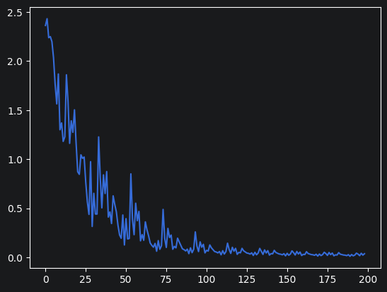
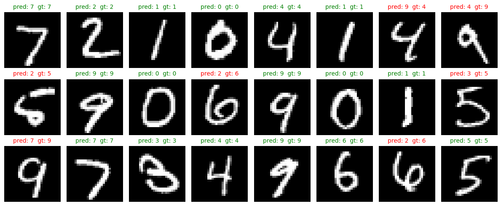

# Autogradus

Tiny autograd engine built from scratch, inspired by Andrej Karpathy's micrograd.

## Usage

```python
from autogradus.engine import Value

a = Value(5)
b = 10
c = a + b
d = c * b

d.backward()
print(c.data, c.grad)  # 15 10.0
print(d.data, d.grad)  # 150 1.0
```

## MNIST

An MLP `(784, 32, 10)` trained from scratch — see [examples/train_mnist.ipynb](examples/train_mnist.ipynb).

Test accuracy: **0.725**
*(200 train / 200 test samples, 10 epochs, lr = 0.03, cross-entropy loss, tanh hidden activation)*




